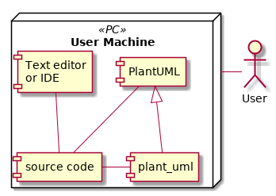

# plant_uml Library Design

This document presents the software design for plant_uml library. The design is based on the [software requirements document](./requirements.md).

## Revision log

### 2019-02-12 Revision 0 - version 0.1.0.1 (2019-02-07)

Initial version.

## System overview

The plant_uml library is intended to be the plug-in style extention to the PlantUML syntax. It implements a set of macroses, which provide shorter and clearer syntax (as a *syntax sugar*) for the specific PlantUML constructs, which are often used during the creation of UML diagrams for the documentation of Python written software and relational databases data model. These macroses are expanded into the standard syntax constructs during the pre-processing stage by the PlantUML software itself. Thus the plant_uml library does not generate any data or perform any calculations on its own. Strictly speaking, it is not even executed.

In order to use the added functionality of the plant_uml library the user should reference in the source code of his diagram the module containing the requied macroses (using PlantUML !include directive) first. After that he can insert any of the macroses defined in that module into his PlantUML source code.

The relationship of the plant_uml library with the other components involved in the creation of PlantUML diagrams is shown in the overview below.

**Related requirements**

| Requirement ID | Requirement name         |
| -------------- | ------------------------ |
| REQ-FUN-L001   | PlantUML Extention       |
| REQ-FUN-P001   | Platform Compatibility   |
| REQ-FUN-F001   | Syntax Sugar             |
| REQ-INT-R001   | PlantUML Compatibility   |
| REQ-USE-U001   | Mode of Operation        |

## Software interface architecture

The diagram below shows the stages of an UML diagram creation from the source code to a rendered image. The plant_uml library is involved only in two stages: coding (interfacing with the user) and expansion of the macroses (interfacing with the PlantUML software). Therefore, two conditions must be met for a successful and proper rendering of a diagram:

* The user is aware of the provided functionality and syntax rules as covered by the user documentation
* The correct user input (source code) is expanded into a correct PlantUML code following the core syntax rules - i.e. the correct implementation of the plant_uml library itself, which is to be tested according to the [software test plan](./test_plan.md)

Note that the incorrect syntax resulting from the invalid user input or improper implementation of the plant_uml library may result in either incorrect and unexpected rendering or in an error generated by the PlantUML software due to it being unable to render an image.

**Related requirements**

| Requirement ID | Requirement name         |
| -------------- | ------------------------ |
| REQ-FUN-L001   | PlantUML Extention       |
| REQ-FUN-P001   | Platform Compatibility   |
| REQ-FUN-F001   | Syntax Sugar             |
| REQ-SIO-F001   | No Input and Ouput Files |
| REQ-INT-R001   | PlantUML Compatibility   |
| REQ-AWM-E001   | Errors                   |
| REQ-USE-U001   | Mode of Operation        |
| REQ-UDR-D001   | User Manual              |
| REQ-UDR-D002   | Inline Documentation     |

## Software units

The operational part of the library, which implements the added functionality, consists of 4 modules: Classes.cuml, Components.cuml, Tables.cuml and General.cuml. The rest of the files and folders is the documentation and boundled usage examples (as in the diagram below).

The implemented macroses are grouped into the separate '.cuml' modules by their specific intended use, as discussed below.

**Related requirements**

| Requirement ID | Requirement name        |
| -------------- | ----------------------- |
| REQ-SIO-F002   | Software Modules Format |
| REQ-USE-U001   | Mode of Operation       |
| REQ-IAR-I001   | Installation process    |
| REQ-UDR-D001   | User Manual             |
| REQ-UDR-D002   | Inline Documentation    |

### Classes.cuml

This module defines non-parametric (as constants) and parameteric macroses (as functions) to be used in the UML class diagrams. Specifically, the decorators for the class stereotype and attributes. The class decorators provide custom stereotype strings and 'badges' (letters in the coloured circles), thus the diffent types of the classes can be easily distinguished. The attributes decorators provide better indication of the static / abstract attributes than the standard {static} and {abstract} modifiers by emphasizing only the attribute's name and not the entire definition line. See examples below.

|  |  |
| --- | --- |

**Related requirements**

| Requirement ID | Requirement name                    |
| -------------- | ----------------------------------- |
| REQ-FUN-F002   | Class Diagram Classes Stereotypes   |
| REQ-FUN-F003   | Class Diagram Attributes Decorators |

### Components.cuml

This module defines parametric macroses (as functions) to create specific non-standard components of the UML components diagrams. They are based on the standard components of the PlantUML components diagram and add custom stereotypes, as shown below.

|  |  |  |
| --- | --- | --- |

**Related requirements**

| Requirement ID | Requirement name                    |
| -------------- | ----------------------------------- |
| REQ-FUN-F004   | Component Diagram Custom Components |

### Tables.cuml

This module provides marcoses to create the database graphical data model representatons based on the modified UML class diagrams, as in the figure below. It implements representation of the database objects (tables, views, etc.) based upon decorated class representation, attributes decorators for emphasizing the primary and foreign keys, and the relational links between the objects.

**Related requirements**

| Requirement ID | Requirement name                              |
| -------------- | --------------------------------------------- |
| REQ-FUN-F005   | Database Data Model as Modified Class Diagram |
| REQ-FUN-F006   | Database Objects as Classes                   |
| REQ-FUN-F007   | Relation between Objects                      |
| REQ-FUN-F008   | Naming of the Objects                         |
| REQ-FUN-F009   | Primary and Foreign Keys                      |

### General.cuml

This module is designed as a placeholder for generic macroses, wich can be used with any type of the PlantUML supported diagrams. For instance, a user may define some project-global constants in this module, like the project name, current version number, etc., which can be referenced across the entire project.

This module is not considered in the [software requirements](./requirements.md), because it does not provide any essential functionality. Currently, it implements a single non-parameteric marcos **GENERATED**, which is expanded at the rendering time into the current date and time stamp in the following format:

## Software architecture verification plan

In order to verify that the software architecture implements the system and software requirements each software item is linked to their relating requirements. These requirements are found in the [software requirements document](./requirements.md) and are linked to tests in the [software test plan](./test_plan.md). By implementing the software architecture and conducting the software test plan the software architecture, items and interfaces are verified as soon as all the tests pass successfully.