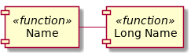
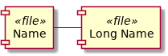
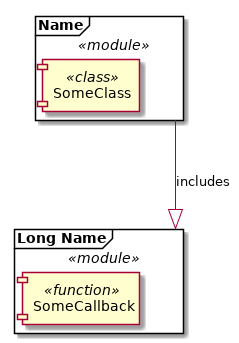
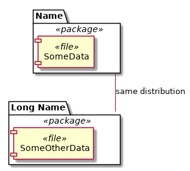
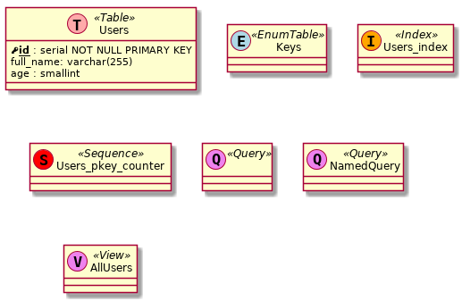
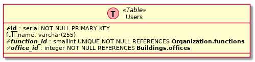
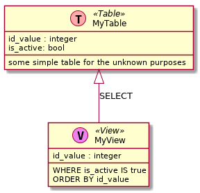
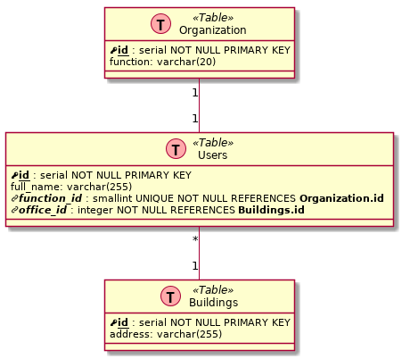
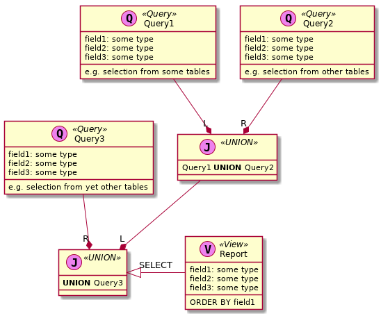

# User Manual on plant_uml

## Scope

This document describes the functionality and intended usage of the macroses provided by the **plant_uml** library. These macroses are written in the PlantUML mark-up language, and they are intended as plug-in extensions of the standard PlantUML syntax.

In order to enable the implemented extensions, the corresponding module must be imported into the source code of a diagram using the PlantUML preprocessor directive '!include'.

The implemented macroses are grouped into separate modules by the application area:

* creation of components diagrams
* creation of class diagrams
* creation of database data model representation as a specialized, custom skinned variant of a class diagram

This document provides the reference information on the syntax of the implemented macroses as well as examples of their usage.

## Table of content

* [Installation](#Installation)
* [General](#Module-General.cuml)
* [Components](#Module-Components.cuml)
* [Classes](#Module-Classes.cuml)
* [Tables](#Module-Tables.cuml)

## Installation

Check-out this package from the repository (e.g. as a git submodule), or simply copy it from another location into your project.

The macroses (global variables, functions and procedures) defined in any module become available only after importing that module into the current diagram using the PlantUML preprocessor directive '!include'. Each of the modules implemented in this package defines a special macros to be used as its own identifier, see table below. Thus, in order to avoid PlantUML errors due to mutltiple imports of the same module (with the legacy preprocessor, if not an issue with the new one), it is recommended to encase the import directive '!include' within the '!ifndef ... !endif' directives, as:

```
!if %not(%variable_exists("$CLASSES"))
    !include Relative/Path/Classes2.cuml
!endif
```

*Legacy preprocessor*:

```
...
!ifndef CLASSES
    !include Relative/Path/Classes2.cuml
!endif
...
```

Note that the path to the module to be included is supposed to be relative to the current diagram source file. See [PlantUML Preprocessing](http://plantuml.com/preprocessing) for the further references.

| Module                             | MODULE_NAME_MACROS       |
| ---------------------------------- | ------------------------ |
| Classes.cuml / Classes2.cuml       | CLASSES / $CLASSES       |
| Components.cuml / Components2.cuml | COMPONENTS / $COMPONENTS |
| Tables.cuml / Tables2.cuml         | TABLES / $TABLES         |
| General.cuml / General2.cuml       | GENERAL / $GENERAL       |

**Table**: Unique identifier macroses of the corresponding modules

## Module General2.cuml

This module defines generic macroses, which can be used with any type of the PlantUML generated diagrams. This module is automatically included within Classes2.cuml, Tables2.cuml and Components2.cuml modules.

### $generated()

Creates the current date and time stamp (compilation / rendering time) in the format 'Generated on YYYY.MM.DD at hh:mm'.

*Example*:

```
@startuml general_generated

!include ../../General2.cuml

title GENERATED

@enduml
```

*Legacy code*:

```
@startuml general_generated

!include ../../General.cuml

title GENERATED

@enduml
```


### `$is_not_defined($var)`

Returns *true* if the variable with the passed name is defined, and *false* otherwise. The name of the variable must be passed in double quotes. Not available in the *legacy* implementation.

*Example*:

```
!if $is_not_defined("$MY_MODULE")
    !include some/path/some_module.pu
!endif
```

### $set_hide()

Defines and sets to *true* the global boolean flag `$HIDE`. Not available in the *legacy* implementation.

### $unset_hide()

Defines and sets to *false* the global boolean flag `$HIDE`. Not available in the *legacy* implementation.

### $is_hide()

Returns *true* if the global boolean flag `$HIDE` is defined and set to *true*, otherwise returns *false*. Not available in the *legacy* implementation.

### `$is_not_hide()`

Returns *true* if the global boolean flag `$HIDE` is not defined, or defined but set to *false*, otherwise returns *false*. Not available in the *legacy* implementation.

*Example*:

Module A.pu

```
class A {
    + a: int = 1
    !if $is_not_hide()
        - b: float = 0.0
    !endif 
}
```

Module B.pu

```
class B {
    + some_method(Other): class A -> int
}

$set_hide()

!include ./A.pu

$unset_hide()

B --> A : checks
```

The attribute *b* of the class *A* will not be shown in the class diagram defined by the module B.pu.

## Module Components2.cuml

This module defines parametric macroses (as functions) to create specific non-standard components of the UML components diagrams.

### $class()

Creates a generic UML component (PlantUML type - *component*) with the stereotype \<\<class\>\>, optionally with the display name being different from the actual component name.

*Usage*:

**$class(Name)** - string 'Name' is the actual and the display name of the component.

**$class(Display Name, Name)** - string 'Name' is the actual name of the component, whereas 'Display Name' - is the display (shown) name of the component.

*Example*:

```
@startuml components_class

!include ../../Components2.cuml

$class(ClassName)

$class(Class Alias, ClassName2)

ClassName - ClassName2

@enduml
```

*Legacy code*:

```
@startuml components_class

!include ../../Components.cuml

class(ClassName)

class(Class Alias, ClassName2)

ClassName - ClassName2

@enduml
```


### $function()

Creates a generic UML component (PlantUML type - *component*) with the stereotype \<\<function\>\>, optionally with the display name being different from the actual component name.

*Usage*:

**$function(Name)** - string 'Name' is the actual and the display name of the component.

**$function(Display Name, Name)** - string 'Name' is the actual name of the component, whereas 'Display Name' - is the display (shown) name of the component.

*Example*:

```
@startuml components_function

!include ../../Components2.cuml

$function(Name)

$function(Long Name, Name2)

Name - Name2

@enduml
```

*Legacy code*:

```
@startuml components_function

!include ../../Components.cuml

function(Name)

function(Long Name, Name2)

Name - Name2

@enduml
```



### $file()

Creates a generic UML component (PlantUML type - *component*) with the stereotype \<\<file\>\>, optionally with the display name being different from the actual component name.

*Usage*:

**$file(Name)** - string 'Name' is the actual and the display name of the component.

**$file(Display Name, Name)** - string 'Name' is the actual name of the component, whereas 'Display Name' - is the display (shown) name of the component.

*Example*:

```
@startuml components_file

!include ../../Components2.cuml

$file(Name)

$file(Long Name, Name2)

Name - Name2

@enduml
```

*Legacy code*:

```
@startuml components_file

!include ../../Components.cuml

file(Name)

file(Long Name, Name2)

Name - Name2

@enduml
```



### $module()

Creates a frame UML component (PlantUML type - *frame*) with the stereotype \<\<module\>\>, optionally with the display name being different from the actual component name.

*Usage*:

**$module(Name)** - string 'Name' is the actual and the display name of the component.

**$module(Display Name, Name)** - string 'Name' is the actual name of the component, whereas 'Display Name' - is the display (shown) name of the component.

*Example*:

```
@startuml components_module

!include ../../Components2.cuml

$module(Name) {
    class(SomeClass)
}

$module(Long Name, Name2) {
    function(SomeCallback)
}

Name ---|> Name2 : includes

@enduml
```

*Legacy code*:

```
@startuml components_module

!include ../../Components.cuml

module(Name) {
    class(SomeClass)
}

module(Long Name, Name2) {
    function(SomeCallback)
}

Name ---|> Name2 : includes

@enduml
```



### $package()

Creates a package UML component (PlantUML type - *package*) with the stereotype \<\<package\>\>, optionally with the display name being different from the actual component name.

*Usage*:

**$package(Name)** - string 'Name' is the actual and the display name of the component.

**$package(Display Name, Name)** - string 'Name' is the actual name of the component, whereas 'Display Name' - is the display (shown) name of the component.

*Example*:

```
@startuml components_package

!include ../../Components2.cuml

$package(Name) {
    file(SomeData)
}

$package(Long Name, Name2) {
    file(SomeOtherData)
}

Name -- Name2 : same distribution

@enduml
```

*Legacy code*:

```
@startuml components_package

!include ../../Components.cuml

package(Name) {
    file(SomeData)
}

package(Long Name, Name2) {
    file(SomeOtherData)
}

Name -- Name2 : same distribution

@enduml
```



### $library()

Creates a package UML component (PlantUML type - *package*) with the stereotype \<\<library\>\>, optionally with the display name being different from the actual component name.

*Usage*:

**$library(Name)** - string 'Name' is the actual and the display name of the component.

**$library(Display Name, Name)** - string 'Name' is the actual name of the component, whereas 'Display Name' - is the display (shown) name of the component.

*Example*:

```
@startuml components_library

!include ../../Components2.cuml

$library(Name) {
    module(io)
}

$library(Long Name, Name2) {
    module(communication)
}

Name <|-- Name2 : depends

@enduml
```

*Legacy code*:

```
@startuml components_library

!include ../../Components.cuml

library(Name) {
    module(io)
}

library(Long Name, Name2) {
    module(communication)
}

Name <|-- Name2 : depends

@enduml
```


### $pc()

*Description*: Creates a node UML component (PlantUML type - *node*) with the stereotype \<\<PC\>\>, optionally with the display name being different from the actual component name.

*Usage*:

**pc(Name)** - string 'Name' is the actual and the display name of the component.

**pc(Display Name, Name)** - string 'Name' is the actual name of the component, whereas 'Display Name' - is the display (shown) name of the component.

*Example*:

```
@startuml components_pc

!include ../../Components2.cuml

$pc(User)

$pc(Another User, User2)

interface network

User )-- network

User2 )-- network

@enduml
```

*Legacy code*:

```
@startuml components_pc

!include ../../Components.cuml

pc(User)

pc(Another User, User2)

interface network

User )-- network

User2 )-- network

@enduml
```


## Module Classes2.cuml

This module defines parameteric macroses (as procedures) to be used in the UML class diagrams. Specifically, the decorators for the class stereotype and attributes.

### Stereotype Decorators

Short-hands for the specific styles of the class decorator - the letter within and the color of the 'class type' circle as well as the stereotype next to it.

| Procedure            | Macros (legacy) | Letter | Color     | Stereotype  |
| -------------------- | --------------- | ------ | --------- | ----------- |
| $mixin_class()       | MIXIN           | M      | lightblue | Mixin       |
| $left_mixin_class()  | LEFT_MIXIN      | L      | lightblue | Left Mixin  |
| $right_mixin_class() | RIGHT_MIXIN     | R      | lightblue | Right Mixin |
| $prototype_class()   | PROTOTYPE       | P      | violet    | Prototype   |
| $singleton_class()   | SINGLETON       | S      | orange    | Singleton   |
| $generic_class()     | GENERIC         | G      | red       | Generic     |

*Usage*: these parameteric unqouted procedures can accept a single parameter or two parameters. E.g. `$mixin_class(Name)` is expanded to `class Name <<(M, lightblue)>>`, and `$mixin_class(Name, Alias)` is expanded to `class "Name" <<(M, lightblue)>> as Alias`.

*Legacy code usage*: Place the required macros as the stereotype text in the class definition, as 'class Name \<\<MACROS\>\>'.

*Example*:

```
@startuml classes_stereotypes

!include ../../Classes2.cuml

$mixin_class(Mixin1)

$left_mixin_class(Mixin2)

$right_mixin_class(Mixin3)

$prototype_class(Proto)

$singleton_class(Single)

$generic_class(ABC)

@enduml
```

*Legacy code*:

```
@startuml classes_stereotypes

!include ../../Classes.cuml

class Mixin1 <<MIXIN>>

class Mixin2 <<LEFT_MIXIN>>

class Mixin3 <<RIGHT_MIXIN>>

class Proto <<PROTOTYPE>>

class Single <<SINGLETON>>

class ABC <<GENERIC>>

@enduml
```


### Attributes Decorators

Macroses to change the appearance of the passed strings in order to indicate the static fields / methods and the abstract methods.

**$static_field(Name)** - places the *{field}* decorator before the attribute name to ensure its position among the field, not methods, and underlines the attribute name. Similar to the *{static}* decorator, but does not underline the entire line, just the passed string.

**$static_method("Name")** - underlines the passed attribute name and places () - parenthesis after it, thus ensuring its position among the methods, not fields. Similar to the *{static}* decorator, but does not underline the entire line, just the passed string and the parenthesis.

**$static_method("Name", "arg1, arg2")** - underlines the passed attribute name and places (arg1, arg2) - after it, thus ensuring its position among the methods, not fields. Similar to the *{static}* decorator, but does not underline the entire line, just the passed string and the parenthesis, whereas the arguments are printed in the normal font.

**$abstract_method("Name")** - emphasizes in *italic* the passed attribute name and places () - parenthesis after it, thus ensuring its position among the methods, not fields. Similar to the *{abstract}* decorator, but does not emphasize the entire line, just the passed string and the parenthesis.

**$abstract_method("Name", "arg1, arg2")** - emphasizes in *italic* the passed attribute name and places (arg1, arg2) - after it, thus ensuring its position among the methods, not fields. Similar to the *{abstract}* decorator, but does not emphasize the entire line, just the passed string and the parenthesis, whereas the arguments are printed in the normal font.

*Example*

```
@startuml classes_attributes

!include ../../Classes2.cuml

class MyClass {
    # $_methodabstract(VirtualMethod) : int -> None
    + $static_method(StaticMethod) : float -> str
}

MyClass : - $static_field(Accounts) : list(int)

@enduml
```

*Legacy code*:

```
@startuml classes_attributes

!include ../../Classes.cuml

class MyClass {
    # abstract(VirtualMethod) : int -> None
    + static_method(StaticMethod) : float -> str
}

MyClass : - static_field(Accounts) : list(int)

@enduml
```


## Module Tables2.cuml

Provides macroses to create the database` graphical data model representatons based on the modified UML class diagrams.

### Tables, Views, etc. - class based elements

Custom 'skins' for the classes - the color of and the letter within the circle as well as the stereotype - in order to represent the different entities within a database. Designed with the typical PostgreSQL data model / internal structure in mind.

| Macros        | Letter | Color     | Stereotype |
| ------------- | ------ | --------- | ---------- |
| $table()       | T      | pink      | Table      |
| $enumeration() | E      | lightblue | EnumTable  |
| $sequence()    | S      | red       | Sequence   |
| $index()       | I      | orange    | Index      |
| $view()        | V      | violet    | View       |
| $query()       | Q      | violet    | Query      |

*Example*:

```
!import ../../Tables2.cuml

$table(Users) {
    field1 : type and constrains
    field2 : type and constrains
    etc.
}
```

*Legacy code*:

```
!import ../../Tables.cuml

table(Users) {
    field1 : type and constrains
    field2 : type and constrains
    etc.
}
```

Note that for all marcoses but `$query()` the display and the actual name of the component (class) are the same. In the case of the `$query()` macros the usage `$query(Name)` results in the actual component name *Name* but an empty display name. Use `$query(Name, Alias)` to display the *Alias* string as the display name of the component *Name*.

*Example*:

```
@startuml tables_classes

!include ../../Tables2.cuml

$table(Users) {
    $primary(id)
    {field} full_name: varchar(255)
}

Users : age : smallint

$enumeration(Keys)

$index(Users_index)

$sequence('Users_pkey_counter')

$query(Query1)

$query(Query2, NamedQuery)

$view(AllUsers)

@enduml
```

*Legacy code*:

```
@startuml tables_classes

!include ../../Tables.cuml

table(Users) {
    primary(id)
    {field} full_name: varchar(255)
}

Users : age : smallint

enumeration(Keys)

index(Users_index)

sequence('Users_pkey_counter')

query(Query1)

query(Query2, NamedQuery)

view(AllUsers)

@enduml
```



### Attributes Modifiers: Primary and Foreign Keys

Parametric unquoted procedures to create primary and foreign key fields with the minimum typing.

*Usage*:

**$primary(Name)** - serial (integer, auto-generated) primary key (not nullable)

**$small_primary(Name)** - small serial (small integer, auto-generated) primary key (not nullable)

**$foreign(Name, OtherTable, OtherField)** - integer foreign key, which references *OtherTable.OtherField*, i.e. '1 to many' relation (not nullable)

**$small_foreign(Name, OtherTable, OtherField)** - small integer foreign key, which references *OtherTable.OtherField*, i.e. '1 to many' relation (not nullable)

**$unique_foreign(Name, OtherTable, OtherField)** - unique integer foreign key, which references *OtherTable.OtherField*, i.e. '1 to 1' relation (not nullable)

**$small_unique_foreign(Name, OtherTable, OtherField)** - unique small integer foreign key, which references *OtherTable.OtherField*, i.e. '1 to 1' relation (not nullable)

*Example*

```
@startuml tables_keys

!include ../../Tables2.cuml

$table(Users) {
    $primary(id)
    {field} full_name: varchar(255)
    $small_unique_foreign(function_id, Organization, functions)
    $foreign(office_id, Buildings, offices)
}

@enduml
```

*Legacy code*:

```
@startuml tables_keys

!include ../../Tables.cuml

table(Users) {
    primary(id)
    {field} full_name: varchar(255)
    small_unique_foreign(function_id, Organization, functions)
    foreign(office_id, Buildings, offices)
}

@enduml
```



### $comment()

Parametric quoted procedure with a single agrument (string), which is forcefully placed into the 'methods' section of an entity based upon class, whereas all fields (of a table or view) are placed into the 'fields' section. Designed for the placement of the actual comments into the tables and 'WHERE ...', 'ORDER BY ...', etc. clauses of the queries, views, etc.

*Example*:

```
@startuml tables_comment

!include ../../Tables2.cuml

$table(MyTable) {
    id_value : integer
    is_active: bool
    $comment("some simple table for the unknown purposes")
}

$view(MyView) {
    id_value : integer
    $comment("WHERE is_active IS true")
    $comment("ORDER BY id_value")
}

MyTable <|-- MyView : SELECT

@enduml
```

*Legacy code*:

```
@startuml tables_comment

!include ../../Tables.cuml

table(MyTable) {
    id_value : integer
    is_active: bool
    comment('some simple table for the unknown purposes')
}

view(MyView) {
    id_value : integer
    comment('WHERE is_active IS true')
    comment('ORDER BY id_value')
}

MyTable <|-- MyView : SELECT

@enduml
```



### Tables Relations: 1 to many and 1 to 1

Creates a graphical representation of the relation between the tables based on the foreign keys. Requires two or three arguments (parameters).

* first parameter - name of the source table (always 1). which is referenced
* second parameter - name of the target table (many or 1), which references
* third parameter (optional) - direction of drawing from the source to the target, defaults to 'd' (as down); allowed values are 'd', 'u', 'l', 'r'

Note: in case of complex diagrams the requested relation orientation is not guaranteed.

*Usage*: The macroses must be used outside the table definitions; the tables referenced must be defined with help of the *$table()* macroses, otherwise they will be displayed as classes.

**$one(Table1, Table2 /,direction/)** - results in Table1 1 -- 1 Table2 (using solid line)

**$one_dot(Table1, Table2 /,direction/)** - results in Table1 1 .. 1 Table2 (using doted line)

**$many(Table1, Table2 /,direction/)** - results in Table1 1 -- * Table2 (using solid line)

**$many_dot(Table1, Table2 /,direction/)** - results in Table1 1 .. * Table2 (using doted line)

*Example*:

```
@startuml tables_relations

!include ../../Tables2.cuml

$table(Organization) {
    $primary(id)
    {field} function: varchar(20)
}

$table(Buildings) {
    $primary(id)
    {field} address: varchar(255)
}

$table(Users) {
    $primary(id)
    {field} full_name: varchar(255)
    $small_unique_foreign(function_id, Organization, id)
    $foreign(office_id, Buildings, id)
}

$one(Organization, Users)

$many(Buildings, Users, u)

@enduml
```

*Legacy code*:

```
@startuml tables_relations

!include ../../Tables.cuml

table(Organization) {
    primary(id)
    {field} function: varchar(20)
}

table(Buildings) {
    primary(id)
    {field} address: varchar(255)
}

table(Users) {
    primary(id)
    {field} full_name: varchar(255)
    small_unique_foreign(function_id, Organization, id)
    foreign(office_id, Buildings, id)
}

one(Organization, Users)

many(Buildings, Users, 'u')

@enduml
```



### Joins

Create visual representation of 'CROSS JOIN', 'INNER JOIN', 'LEFT OUTER JOIN', 'RIGHT OUTER JOIN' and 'FULL OUTER JOIN' SQL queries often used in the definition of a complex view. These parametric macroses create a diagram component based on the *class*, links to the left and right parts of the join (tables, views or other queries) with the clear indication which part is left and which is right, and, except for the 'CROSS JOIN', the selection / linking criteria (the 'ON' clause). The representation of any type of joins is marked by 'J' letter in the **pink** circle with a stereotype indicating the type of a join. The joins have actual names as the diagram components, but no (empty) display names.

*Usage*: The join-macroses are supposed to be used outside any class / table / view / etc. definition. The left and right parts of a join must be defined anywhere in the diagram`s source code, otherwise it will be represented by a simple class.

**cross_join(LeftTable, RightTable, JoinName /, LeftShowName/)**

**inner_join(LeftTable, RightTable, JoinName /, LeftShowName, JoinOn/)**

**left_join(LeftTable, RightTable, JoinName /, LeftShowName, JoinOn/)**

**right_join(LeftTable, RightTable, JoinName /, LeftShowName, JoinOn/)**

**full_join(LeftTable, RightTable, JoinName /, LeftShowName, JoinOn/)**

The **LeftTable** and **RightTable** are the (actual) names of the diagram components representing the left and right parts of the join (tables, views, other joins, etc.); the links (solid lines, consists of relation) to them are created and shown with the letters 'L' and 'R' to distinguish the left from right parts. The **RightTable** is also shown in the body of the join object as a part of the 'LeftShowName JOIN_TYPE RightTable' construct.

Note that if the **LeftShowName** argument is provided, it is supposed to be the display name of the **LeftTable**, which is usually the value of the **LeftTable** argument itself. If the argument **LeftShowName** is not provided, it is replaced by an empty string, which is convenient for creation of the representation of the chained joins, like:

```sql
table1 LEFT JOIN table2 ON table1.field1 = table2.field2
    LEFT JOIN table2 ON ....
```

The argument **JoinOn** is used to create the construct 'ON ...' inside the body of the join, i.e. the conditional clause. Must be passed in double quotes. If the dispay name is not provided, this parameter must be passed as the value of the keyword argument `$condition`. Note that the 'CROSS JOIN' does not have the conditional clause.

*Example*

```
@startuml tables_joins

!include ../../Tables2.cuml

$table(Organization) {
    $primary(id)
    {field} function: varchar(20)
}

$table(Buildings) {
    $primary(id)
    {field} address: varchar(255)
}

$table(Users) {
    $primary(id)
    {field} full_name: varchar(255)
    $small_unique_foreign(function_id, Organization, id)
    $foreign(office_id, Buildings, id)
}

$one(Organization, Users, 'r')

$many(Buildings, Users, 'u')

$left_join(Users, Organization, j1, Users, "Users.function_id = Organization.id")

$left_join(j1, Buildings, j2, $condition = "Users.office_id = Buildings.id")

$view(Report) {
    {field} full_name: varchar(255)
    {field} function: varchar(20)
    {field} function: varchar(255)
    $comment("ORDER BY full_name")
}

j2 <|- Report : SELECT

@enduml
```

*Legacy code*:

```
@startuml tables_joins

!include ../../Tables.cuml

table(Organization) {
    primary(id)
    {field} function: varchar(20)
}

table(Buildings) {
    primary(id)
    {field} address: varchar(255)
}

table(Users) {
    primary(id)
    {field} full_name: varchar(255)
    small_unique_foreign(function_id, Organization, id)
    foreign(office_id, Buildings, id)
}

one(Organization, Users, 'r')

many(Buildings, Users, 'u')

left_join(Users, Organization, Users.function_id, Organization.id, j1, Users)

left_join(j1, Buildings, Users.office_id, Buildings.id, j2)

view(Report) {
    {field} full_name: varchar(255)
    {field} function: varchar(20)
    {field} function: varchar(255)
    comment(ORDER BY full_name)
}

j2 <|- Report : SELECT

@enduml
```


### Set Operations: Unions, Intersections, Exceptions

Create visual representations of the set operations on the queries: 'UNION', 'UNION ALL', 'INTERSECT', 'INTERSECT ALL', 'EXCEPT' and 'EXCEPT ALL' - often used in the definition of a complex view. These parametric unquoted procedures create a diagram component based on the *class*, links to the left and right parts of the operation (joins or other queries) with the clear indication which part is left and which is right. The representation of any type of the set operations is marked by 'J' letter in the **violet** circle with a stereotype indicating the actual operation. These representation have actual names as the diagram components, but no (empty) display names.

*Usage*: The set operations macroses are supposed to be used outside any join / query / etc. definition. The left and right parts of the operation must be defined anywhere in the diagram`s source code, otherwise it will be represented by a simple class.

**$union(LeftQuery, RightQuery, Name /, LeftShowName/)**

**$union_all(LeftQuery, RightQuery, Name /, LeftShowName/)**

**$intersect(LeftQuery, RightQuery, Name /, LeftShowName/)**

**$intersect_all(LeftQuery, RightQuery, Name /, LeftShowName/)**

**$except(LeftQuery, RightQuery, Name /, LeftShowName/)**

**$except_all(LeftQuery, RightQuery, Name /, LeftShowName/)**

The **LeftQuery** and **RightQuery** are the (actual) names of the diagram components representing the left and right parts of the operation (tables, views, joins, etc.); the links (solid lines, consists of relation) to them are created and shown with the letters 'L' and 'R' to distinguish the left from right parts. The **RightQuery** is also shown in the body of the representation object as a part of the 'LeftShowName OPERATION RightQuery' construct.

Note that if the **LeftShowName** argument is provided, it is supposed to be the display name of the **LeftQuery**, which is usually the value of the **LeftQuery** argument itself. If the argument **LeftShowName** is not provided, it is replaced by an empty string, which is convenient for creation of the representation of the chained operations, like:

```sql
query1 UNION query2
    UNION query3 ....
```

*Example*:

```
@startuml tables_unions

!include ../../Tables2.cuml

$query(Query1, Query1) {
    field1: some type
    field2: some type
    field3: some type
    $comment("e.g. selection from some tables")
}

$query(Query2, Query2) {
    field1: some type
    field2: some type
    field3: some type
    $comment("e.g. selection from other tables")
}

$query(Query3, Query3) {
    field1: some type
    field2: some type
    field3: some type
    $comment("e.g. selection from yet other tables")
}

$union(Query1, Query2, j1, Query1)

$union(j1, Query3, j2)

$view(Report) {
    field1: some type
    field2: some type
    field3: some type
    $comment("ORDER BY field1")
}

j2 <|- Report : SELECT

@enduml
```

*Legacy code*:

```
@startuml tables_unions

!include ../../Tables.cuml

query(Query1, Query1) {
    field1: some type
    field2: some type
    field3: some type
    comment(e.g. selection from some tables)
}

query(Query2, Query2) {
    field1: some type
    field2: some type
    field3: some type
    comment(e.g. selection from other tables)
}

query(Query3, Query3) {
    field1: some type
    field2: some type
    field3: some type
    comment(e.g. selection from yet other tables)
}

union(Query1, Query2, j1, Query1)

union(j1, Query3, j2)

view(Report) {
    field1: some type
    field2: some type
    field3: some type
    comment(ORDER BY field1)
}

j2 <|- Report : SELECT

@enduml
```

